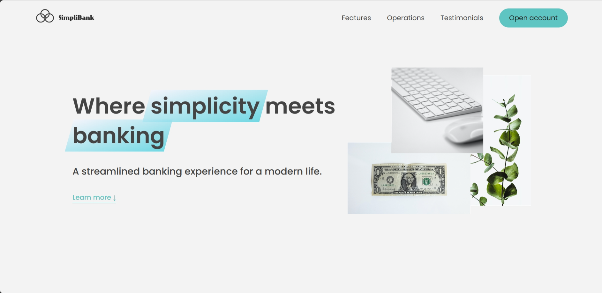

# SimpliBank landing page

SimpliBank landing page I just made it after learning some advance JavaScript DOM manipulations from Jonas Schmedtmann's course.

- [👉Live Preview👈](https://simplibank-landing-page-alamin.netlify.app/)

### Built with

- Semantic HTML5 markup
- CSS custom properties
- Javascript
- Used advance DOM manipulations

## My Social Media

- LinkedIn - [@CodeWithAlamin](https://www.linkedin.com/in/CodeWithAlamin)
- Twitter - [@CodeWithAlamin](https://www.twitter.com/CodeWithAlamin)
- Frontend Mentor - [@CodeWithAlamin](https://www.frontendmentor.io/profile/CodeWithAlamin)

#### Screenshot

